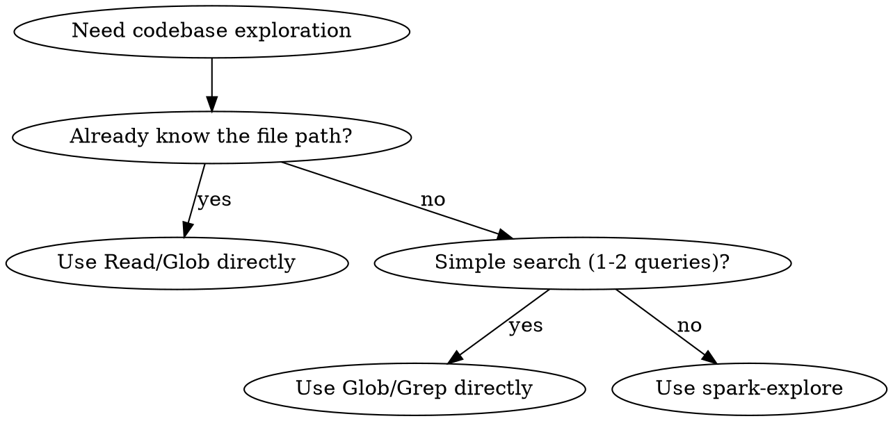

# Codebase Exploration with Codex Spark

Uses gpt-5.3-codex-spark via Codex CLI in a read-only sandbox. Runs as a separate process, consuming zero main context.

## When to Use



## Execution

Pass a specific, detailed query to the script:

```bash
${CLAUDE_PLUGIN_ROOT}/skills/spark-explore/scripts/spark-explore.sh "$ARGUMENTS"
```

If `$ARGUMENTS` is empty, formulate the query yourself based on what you need to explore.

**Good queries:**
- "Find all authentication middleware and trace the request validation flow"
- "List files handling database connections and explain the pooling strategy"
- "What patterns are used for error handling in src/api/?"

**Bad queries:**
- "explore the codebase" (too vague)
- "find files" (no specifics)

For complex exploration, run multiple script calls in parallel with different focused queries rather than one broad query.

Present the output directly to the user.

## Error Handling

- Auth error → tell user to run `codex login`
- `command not found` → tell user to install Codex CLI (`npm i -g @openai/codex`)
- Empty/unhelpful output → reformulate with more specific terms, or fall back to Glob/Grep
