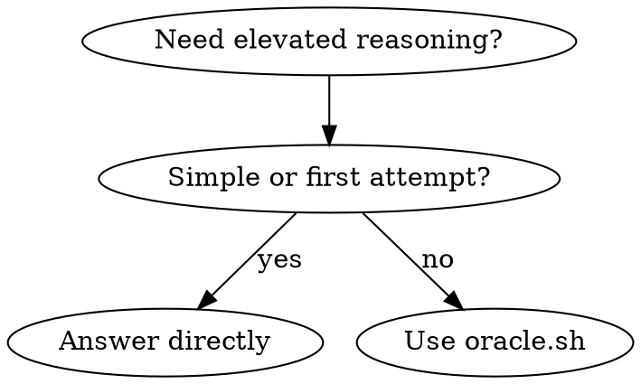

# Deep Reasoning with Codex Max

Uses gpt-5.1-codex-max via Codex CLI in a read-only sandbox. Runs as a separate process, consuming zero main context.

## When to Use



**Use when:**
- Complex architecture design or multi-system trade-offs
- After completing significant work (self-review)
- 2+ failed fix attempts (hard debugging)
- Unfamiliar code patterns
- Security/performance concerns

**Avoid when:**
- Simple file operations (use direct tools)
- First attempt at any fix (try yourself first)
- Questions answerable from code you've already read
- Trivial decisions (variable names, formatting)
- Things you can infer from existing code patterns

## Execution

```bash
${CLAUDE_PLUGIN_ROOT}/skills/using-oracle/scripts/oracle.sh "$ARGUMENTS"
```

If `$ARGUMENTS` is empty, formulate the query yourself based on context.

**Include context**: When the query involves code, include relevant code snippets, file paths, or `git diff` output directly in the query string.

**Good queries:**
- "Should we split this monolith into microservices? The codebase has 50k LOC with tightly coupled modules."
- "Review this authentication implementation for security concerns: $(git diff HEAD~1)"
- "Compare event-driven vs request-response architecture for our real-time notification system."

**Bad queries:**
- "What should we do?" (too vague)
- "Review my code" (no context provided)

For complex analysis, run multiple script calls in parallel with different focused queries rather than one broad query.

Present the output directly to the user.

## Error Handling

- Auth error → tell user to run `codex login`
- `command not found` → tell user to install Codex CLI (`npm i -g @openai/codex`)
- Empty/unhelpful output → reformulate with more specific context
